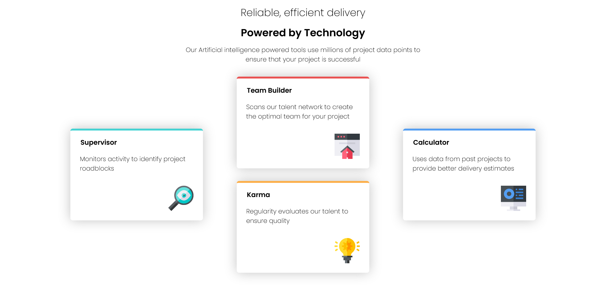
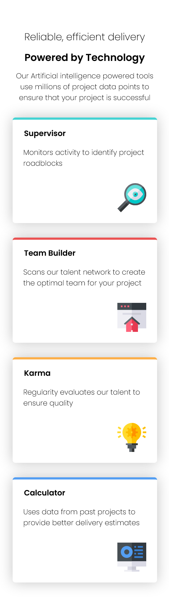

# Frontend Mentor - Four card feature section solution

This is a solution to the [Four card feature section challenge on Frontend Mentor](https://www.frontendmentor.io/challenges/four-card-feature-section-weK1eFYK). Frontend Mentor challenges help you improve your coding skills by building realistic projects. 

## Table of contents

  - [The challenge](#the-challenge)
  - [Screenshot](#screenshot)
  - [Links](#links)
  - [Built with](#built-with)
  - [Author](#author)

### The challenge

Users should be able to:

- View the optimal layout for the site depending on their device's screen size

### Screenshot

Version desktop

Version mobile

### Links

- Solution URL: [Add solution URL here](https://github.com/AraMilagros/FourCardFeatures)
- Live Site URL: [Add live site URL here](https://fourdcardsanimate.netlify.app/)

### Built with

- Semantic HTML5 markup
- CSS Grid
- [React](https://reactjs.org/) - JS library
- [Styled Components](https://styled-components.com/) - For styles

## Author

- Frontend Mentor - [@AraMilagros](https://www.frontendmentor.io/profile/AraMilagros)
